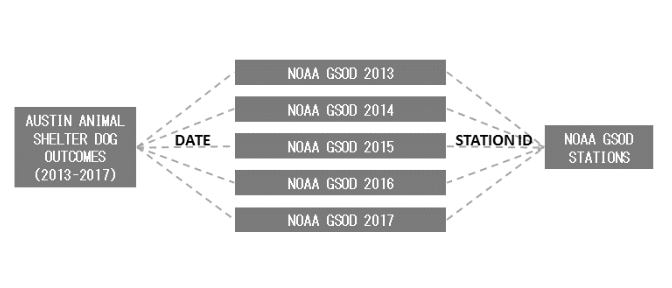
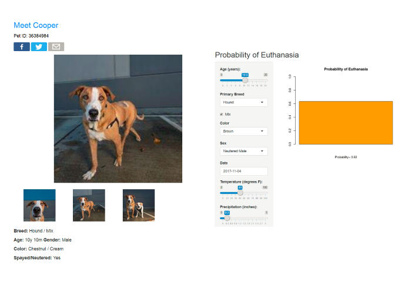
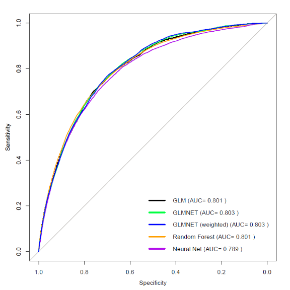
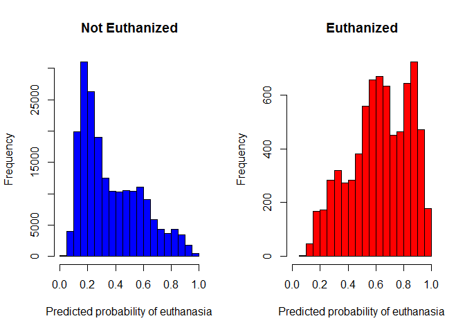
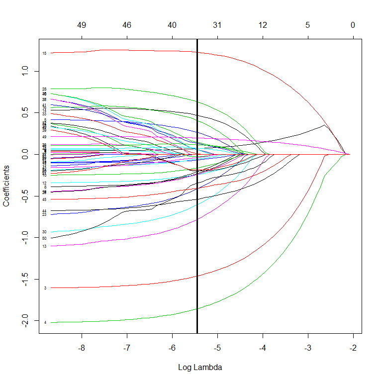

Dog Euthanasia Prediction
================
Cooper Schumacher
November, 2017

| **Primary skills**           | **Primary Programs**                                                                                                                                                                         |
|------------------------------|----------------------------------------------------------------------------------------------------------------------------------------------------------------------------------------------|
| Querying                     | SQL, BigQuery                                                                                                                                                                                |
| Data Management and Modeling | R                                                                                                                                                                                            |
| Presentation                 | [R Shiny](https://cooperschumacher.shinyapps.io/DogPrediction/) , [Tableau](https://public.tableau.com/profile/cooper.schumacher#!/vizhome/AnimalShelterDogEuthanizationDescriptives/Story1) |

Motivation and Objective
========================

I love dogs and hope to adopt in the near future now that I have moved away from my childhood home and have no furry companion. I think that one of the great aspects of choosing to adopt a pet rather than buy is lowering the large number of pets who will have to be euthanized. The probability that a dog will be euthanized is something that I thought would be interesting to have available. There are many other considerations when adopting a dog, but with all else equal, I would prefer adopting a dog who otherwise is at a higher risk of euthanasia.

-   **Objective**: come up with a way to predict the probability that a shelter dog will be euthanized.


<p class="caption">
My family dog, Laika
</p>

Data Sources
============

I considered **Austin Animal Shelter dog outcome data** from 2013 to 2017 (around 41,000 dogs). I was specifically interested in whether a dog was euthanized (other outcomes include adoption, transfer, return to owner and died). Other important characteristics of the dogs were included such as breed, color, age upon outcome, sex/intact, etc. Descriptive plots are provided in this [Tableau Story](https://public.tableau.com/profile/cooper.schumacher#!/vizhome/AnimalShelterDogEuthanizationDescriptives/Story1). I also combined this dataset with publically available **NOAA climate data**, as it seemed plausible that weather could influence adoption patterns and be important for prediction of a dog's outcome.

Data Querying
=============

I ran SQL queries (integrated within R) to access and merge data from Google Bigquery. The diagram below shows the relationship of the databases, and code is provided later in the document.



Data Management
===============

In order to get data into a useful format, I had to parse data and implement strategies to reduce the number of groups for a few important variables. Some examples include:

-   **Age**: formatted as text strings ("3 years", "1 year", "6 months", "4 weeks" etc.), which I converted into a continuous variable.
-   **Breed**: formatted as either "Breed", "Breed Mix", or "Breed 1 / Breed 2" and having 1845 categories. I created 2 variables: *Mix* and *Primary Breed*.
    -   If the string has "Mix" or "/" in it, then it is a mix.
    -   If two breeds are given, the first is assumed to be the primary breed. Common breed groups were joined together (e.g. all breeds with "Terrier" go into a single terrier group).
-   **Color**: formatted as a single word, multiple words or in the format "Color1 / Color2", and had 330 categories.
    -   I assumed the first word in the string was the primary color. I also grouped some categories together (e.g. "Creme" and "Tan").

Modeling
========

### Important features of the data considered

-   **The outcome is imbalanced**, as only around 4% of dogs in the Austin Animal shelter are Euthanized.
    -   *Note: Austin's low proportion of euthanasia is not generalizeable to the rest of the US. However, without access to better data, and because the end result is only one of many factors in adopting a dog, I was okay with this assumption. Because of this, I interpret the predicted probabilities a little more like general levels of risk, rather than accurate probabilities.*
-   **There are relatively few variables** in comparison to the number of observations.

### Models Considered

-   Logistic regression / GLM
-   Regularized GLM (using glmnet)
-   **Weighted Regularized GLM (using glmnet)**
-   Random Forest
-   Neural Net

Because there are relatively few predictors, I was able to fit a logistic regression model in addition to more complex models (i.e. random forest, neural net). I also considered regularized GLM's and weighting to in attempt to help account for the imbalanced nature of the data. The weighted regularized GLM (glmnet model with *α* = 1 and *λ* = 0.004) had the best performance and was used for the final model, although the models performed very similarly.

### Validation

Tuning parameters for the models, as well as comparisons between the types of models were based on **repeated 10-fold cross-validation** using the **ROC area under the curve (AUC) as a validation metric**. AUC was used as a metric because of the imbalanced outcome. Accuracy would have been a poor metric because with only 4% of dogs being euthanized, models may be incentivized to never predict euthanasia. For example, a model which never predicts euthanasia (regardless of the data) would be a strong model according to accuracy, but clearly is not a useful model.

Prediction
==========

I created a **[Shiny App](https://cooperschumacher.shinyapps.io/DogPrediction/)** in R to easily predict a dog's probability of euthanasia using the weighted regularized GLM model. A screenshot of the app is provided below. As an example, I considered this online posting for a dog with the same name as me: a 10 year old neutered male hound mix, age 10. I looked on a Saturday in November when the temperature was a high of 41 degrees and 0.3 inches of precipitation. Unfortunately he has a moderately high probability of euthanasia (0.63), in large part due to his age. When I am ready to adopt a dog I can use this app to help inform my decision.



<br> <br> <br>

Annotated R code
================

### Data Querying

I used the ***bigrquery*** package in R to query data from Google BigQuery with SQL code. I combined Austin animal shelter data with NOAA climate data. The daily climate data (sepparate databases for 2013, 2014, 2015, 2016 and 2017) were merged and matched with the animal shelter data based on date. I also had to match each of the NOAA daily climate databases with the NOAA station database based on station id variables, and restricted the data to an Austin station.

``` r
library(bigrquery)

# BigQuery project ID
project <- 

# SQL code
sql <- "SELECT 
location,
temperature,
precip,
a.Year,
a.Month,
a.Day,
a.AnimalID,
a.Name,
a.MonthYear,
a.DateofBirth,
a.OutcomeType,
a.AnimalType, 
a.SexUponOutcome,
a.AgeUponOutcome,
a.Breed,
a.COLOR
FROM

(SELECT  
c.name AS location,
b.temp AS temperature,
b.prcp AS precip,
a.*
FROM 
[petadoption-182714:AustinAnimalShelter.JustDog] AS a 
JOIN 
[bigquery-public-data:noaa_gsod.gsod2013] AS b 
ON  
a.Year=b.year AND a.Month=b.mo AND a.Day=b.da
JOIN 
[bigquery-public-data:noaa_gsod.stations] AS c
ON  
b.stn=c.usaf  AND b.wban=c.wban
WHERE 
c.country='US' AND c.state='TX' AND c.name='AUSTIN 33 NW'),

(SELECT  
c.name AS location,
b.temp AS temperature,
b.prcp AS precip,
a.*
FROM 
[petadoption-182714:AustinAnimalShelter.JustDog] AS a 
JOIN 
[bigquery-public-data:noaa_gsod.gsod2014] AS b 
ON  
a.Year=b.year AND a.Month=b.mo AND a.Day=b.da
JOIN 
[bigquery-public-data:noaa_gsod.stations] AS c
ON  
b.stn=c.usaf  AND b.wban=c.wban
WHERE 
c.country='US' AND c.state='TX' AND c.name='AUSTIN 33 NW'),

(SELECT  
c.name AS location,
b.temp AS temperature,
b.prcp AS precip,
a.*
FROM 
[petadoption-182714:AustinAnimalShelter.JustDog] AS a 
JOIN 
[bigquery-public-data:noaa_gsod.gsod2015] AS b 
ON  
a.Year=b.year AND a.Month=b.mo AND a.Day=b.da
JOIN 
[bigquery-public-data:noaa_gsod.stations] AS c
ON  
b.stn=c.usaf  AND b.wban=c.wban
WHERE 
c.country='US' AND c.state='TX' AND c.name='AUSTIN 33 NW'),

(SELECT  
c.name AS location,
b.temp AS temperature,
b.prcp AS precip,
a.*
FROM 
[petadoption-182714:AustinAnimalShelter.JustDog] AS a 
JOIN 
[bigquery-public-data:noaa_gsod.gsod2016] AS b 
ON  
a.Year=b.year AND a.Month=b.mo AND a.Day=b.da
JOIN 
[bigquery-public-data:noaa_gsod.stations] AS c
ON  
b.stn=c.usaf  AND b.wban=c.wban
WHERE 
c.country='US' AND c.state='TX' AND c.name='AUSTIN 33 NW'),

(SELECT  
c.name AS location,
b.temp AS temperature,
b.prcp AS precip,
a.*
FROM 
[petadoption-182714:AustinAnimalShelter.JustDog] AS a 
JOIN 
[bigquery-public-data:noaa_gsod.gsod2017] AS b 
ON  
a.Year=b.year AND a.Month=b.mo AND a.Day=b.da
JOIN 
[bigquery-public-data:noaa_gsod.stations] AS c
ON  
b.stn=c.usaf  AND b.wban=c.wban
WHERE 
c.country='US' AND c.state='TX' AND c.name='AUSTIN 33 NW')

ORDER BY a.Year, a.Month, a.Day"


# run query
dogs <- query_exec(query = sql, project = project, useLegacySql = FALSE)
```

### Data Management

There were moderate amounts of data cleaning required, and several variables needed significant work to change them into a useful format. These first variables defined are the simpler ones, requiring only a little data management such as getting the day of the week from the date and scaling the continous variables to be on a 0 to 1 scale.

``` r
# load package for some of the data parsing
library(dplyr)

# Euthanasia (Outcome) -----------------------------#

# Remove the few missing/disposal/Rto-Adopt, and 2 missing observations
dogs <- dogs[!is.na(dogs$a_OutcomeType) & (dogs$a_OutcomeType %in% c("Adoption", 
    "Died", "Euthanasia", "Return to Owner", "Transfer")), ]

# Focus on euthanasia
dogs$euthanasia <- ifelse(dogs$a_OutcomeType == "Euthanasia", 1, 0)


# Sex -----------------------------#

# change the one 'Null' observation to unknown
dogs$a_SexUponOutcome <- ifelse(dogs$a_SexUponOutcome == "NULL", "Unknown", 
    dogs$a_SexUponOutcome)

# define variable for just sex (For Descriptives)
dogs$sex <- ifelse(dogs$a_SexUponOutcome %in% c("Intact Female", "Spayed Female"), 
    "Female", "Unknown")
dogs$sex <- ifelse(dogs$a_SexUponOutcome %in% c("Intact Male", "Neutered Male"), 
    "Male", dogs$sex)

# Intact -----------------------------#

# define variable for intact (for descriptives)
dogs$intact <- ifelse(dogs$a_SexUponOutcome %in% c("Intact Female", "Intact Male"), 
    "Intact", "Unknown")
dogs$intact <- ifelse(dogs$a_SexUponOutcome %in% c("Spayed Female", "Neutered Male"), 
    "Spayed/Neutered", dogs$intact)

# Month -----------------------------#
dogs$month <- as.factor(dogs$a_Month)

# Day of Week? -----------------------------#
dogs$dayofweek <- weekdays(as.Date(dogs$a_MonthYear, "%m/%d/%Y"))

# Temperature -----------------------------#

# scale temperature for modeling so ranges from 0 to 1
max.temps <- max(dogs$temperature)
min.temps <- min(dogs$temperature)
dogs$temperature.scaled <- (dogs$temperature - min.temps)/(max.temps - min.temps)

# Precipitation ---------------------------#

# scale precipitation for modeling so ranges from 0 to 1
precip.min <- min(dogs$precip)
precip.max <- max(dogs$precip)
dogs$precip.scaled <- (dogs$precip - precip.min)/(precip.max - precip.min)
```

**Age** was the first variable requiring some work, as it was in a string format:

``` r
head(dogs$a_AgeUponOutcome)
```

    ## [1] "8 years"  "7 years"  "6 years"  "2 months" "3 years"  "1 year"

Using *strsplit()*, I sepparated the number from the rest of the string. I then used *grepl()* to determine whether "year", "month", "week" or "day" was in the string to determine what number to adjust by so all units ended up as years.

``` r
# split the string and take just the number
age.number <- as.numeric(vapply(strsplit(dogs$a_AgeUponOutcome, " "), `[`, 1, 
    FUN.VALUE = character(1)))

# adjust the number depending on if the original number's units were
age.number2 <- ifelse(grepl("month", dogs$a_AgeUponOutcome), age.number/12, 
    age.number)
age.number3 <- ifelse(grepl("week", dogs$a_AgeUponOutcome), age.number/52.1429, 
    age.number2)
dogs$age <- ifelse(grepl("day", dogs$a_AgeUponOutcome), age.number/365.25, age.number3)

# remove the few age 0 observations (most are clear data entry errors)
dogs <- dogs[dogs$age != 0, ]

# scale age for modeling so ranges from 0 to 1
age.min <- min(dogs$age)
age.max <- max(dogs$age)
dogs$age.scaled <- (dogs$age - age.min)/(age.max - age.min)
```

**Breed** was formated as either "*Breed*", "*Breed Mix*" or "*Breed 1 / Breed 2*". For example:

    ## [1] "Chihuahua Shorthair"           "German Shepherd Mix"          
    ## [3] "Rottweiler/Labrador Retriever"

This lead to there being 1845 different groups. In order to reduce the number of categories while trying to maintain information, I created two variables: **Mix** and **Primary Breed**. A dog was considered a mix if it has "Mix" or "/" in the string.

``` r
# Mix if 'Mix' or '/' (to sepparate two breeds) is in the name
dogs$mix <- ifelse(grepl("Mix", dogs$a_Breed) | grepl("/", dogs$a_Breed), "Mix", 
    "Not Mix")
```

The primary breed was assumed to be the first breed if two were given. I then combined certain breeds into groups based on common breed groups. For example any dog with "Terrier" in the name (determined by using *grepl()* again) was put into a terrier group. I combined all of the groups with small counts into a single "other" group using the ***dplyr*** package and pipes.

``` r
# Define variable for primary breed (assume first breed in ___/____ format
# is primary)
dogs$primarybreed <- ifelse(grepl("Mix", dogs$a_Breed), gsub(" Mix", "", dogs$a_Breed), 
    dogs$primarybreed <- vapply(strsplit(dogs$a_Breed, "/"), `[`, 1, FUN.VALUE = character(1)))

# group breeds into common breed groups based on knowledge of breeds For
# example, first line groups all breeds with 'Terrier' in the name into one
# group
dogs$primarybreed <- ifelse(grepl("Terrier", dogs$primarybreed), "Terrier", 
    dogs$primarybreed)
dogs$primarybreed <- ifelse(grepl("Staffordshire", dogs$primarybreed), "Terrier", 
    dogs$primarybreed)
dogs$primarybreed <- ifelse(grepl("Spaniel", dogs$primarybreed), "Spaniel", 
    dogs$primarybreed)
dogs$primarybreed <- ifelse(grepl("Collie", dogs$primarybreed), "Collie", dogs$primarybreed)
dogs$primarybreed <- ifelse(grepl("Retriever", dogs$primarybreed), "Retriever", 
    dogs$primarybreed)
dogs$primarybreed <- ifelse(grepl("Husky", dogs$primarybreed), "Husky", dogs$primarybreed)
dogs$primarybreed <- ifelse(grepl("Corgi", dogs$primarybreed), "Corgi", dogs$primarybreed)
dogs$primarybreed <- ifelse(grepl("Chihuahua", dogs$primarybreed), "Chihuahua", 
    dogs$primarybreed)
dogs$primarybreed <- ifelse(grepl("Shepherd", dogs$primarybreed), "Shepherd", 
    dogs$primarybreed)
dogs$primarybreed <- ifelse(grepl("Dachshund", dogs$primarybreed), "Dachshund", 
    dogs$primarybreed)
dogs$primarybreed <- ifelse(grepl("Poodle", dogs$primarybreed), "Poodle", dogs$primarybreed)
dogs$primarybreed <- ifelse(grepl("Bull", dogs$primarybreed) | grepl("bull", 
    dogs$primarybreed), "Bull", dogs$primarybreed)
dogs$primarybreed <- ifelse(grepl("Hound", dogs$primarybreed) | grepl("hound", 
    dogs$primarybreed), "Hound", dogs$primarybreed)

# Pool breeds with less than 300 observations into 'Other'
dogs <- dogs %>% group_by(primarybreed) %>% mutate(count = n())
dogs$primarybreed <- ifelse(dogs$count < 300, "Other", dogs$primarybreed)
```

**Color** required similar reformating as breed, as it had 330 different groups. Color was formatted as "*Color*" or "Color 1 / Color 2", with a color sometimes being multiple words. For example:

    ## [1] "Black"         "Brown Brindle" "White/Brown"

The first word in the color string was used for the main color, with several groups then being combined based on knowledge of colors.

``` r
# For multiple colors, just take the first color (ignore characters in
# string after a '/' or ' ' )
dogs$a_COLOR <- vapply(strsplit(dogs$a_COLOR, "/"), `[`, 1, FUN.VALUE = character(1))
dogs$a_COLOR <- vapply(strsplit(dogs$a_COLOR, " "), `[`, 1, FUN.VALUE = character(1))

# combine some of color groups (based on knowledge of dog colors)
dogs$Color <- ifelse(dogs$a_COLOR == "Ruddy", "Red", dogs$a_COLOR)
dogs$Color <- ifelse(dogs$Color == "Agouti", "Gray", dogs$Color)
dogs$Color <- ifelse(dogs$Color == "Apricot", "Tan", dogs$Color)
dogs$Color <- ifelse(dogs$Color == "Orange", "Brown", dogs$Color)
dogs$Color <- ifelse(dogs$Color == "Red", "Brown", dogs$Color)
dogs$Color <- ifelse(dogs$Color == "Gold", "Tan", dogs$Color)
dogs$Color <- ifelse(dogs$Color == "Liver", "Brown", dogs$Color)
dogs$Color <- ifelse(dogs$Color == "Buff", "Tan", dogs$Color)
dogs$Color <- ifelse(dogs$Color == "Fawn", "Tan", dogs$Color)
dogs$Color <- ifelse(dogs$Color == "Sable", "Tan", dogs$Color)
dogs$Color <- ifelse(dogs$Color == "Cream", "White", dogs$Color)
dogs$Color <- ifelse(dogs$Color == "Silver", "Gray", dogs$Color)
dogs$Color <- ifelse(dogs$Color == "Chocolate", "Brown", dogs$Color)
dogs$Color <- ifelse(dogs$Color == "Yellow", "Tan", dogs$Color)
```

Descriptives
------------

Code for producing descriptive plots and tables is provided below. Descriptive plots are also provided in this [Tableau Story](https://public.tableau.com/profile/cooper.schumacher#!/vizhome/AnimalShelterDogEuthanizationDescriptives/Story1).

<br>

``` r
library(ggplot2)

#-----Age-----#


# stacked barplot of euthanasia with different age groups
Age.group <- cut(dogs$age, c(0, 0.5, 1, 2, 3, 4, 5, 6, 7, 8, 9, 10, 11, 12, 
    13, 14, 15, 22))
Outcome <- ifelse(dogs$euthanasia, "Euthanized", "Different Outcome")
ggplot(dogs, aes(Age.group)) + geom_bar(aes(fill = Outcome), position = "stack") + 
    scale_fill_manual(values = c("skyblue", "red"))
# stacked proportion plot of euthanasia with different age groups
ggplot(dogs, aes(Age.group)) + geom_bar(aes(fill = Outcome), position = "fill") + 
    scale_fill_manual(values = c("skyblue", "red"))

# mean age for euthanized and non euthanized dogs
by(dogs$age, dogs$euthanasia, mean)


#-----Sex-----#

# barplot
Sex <- as.factor(dogs$a_SexUponOutcome)

ggplot(dogs, aes(Sex)) + geom_bar(aes(fill = Outcome), position = "stack") + 
    scale_fill_manual(values = c("skyblue", "red"))


# proportion table
round(prop.table(table(Euthanized = dogs$euthanasia, Sex = dogs$a_SexUponOutcome), 
    margin = 2) * 100, digits = 1)


#-----Breed-----#


# barplot
PrimaryBreed <- dogs$primarybreed
ggplot(dogs, aes(PrimaryBreed)) + geom_bar(aes(fill = Outcome), position = "stack") + 
    scale_fill_manual(values = c("skyblue", "red"))

# proportion table
round(prop.table(table(dogs$euthanasia, dogs$primarybreed), margin = 2) * 100, 
    digits = 1)


#-----Day of Week-----#

# barplot
DayofWeek <- factor(dogs$dayofweek, levels = c("Monday", "Tuesday", "Wednesday", 
    "Thursday", "Friday", "Saturday", "Sunday"))

ggplot(dogs, aes(DayofWeek)) + geom_bar(aes(fill = Outcome), position = "stack") + 
    scale_fill_manual(values = c("skyblue", "red"))

# proportion table
round(prop.table(table(Euthanized = dogs$euthanasia, Day = dogs$dayofweek), 
    margin = 2) * 100, digits = 1)

#-----Mix-----#

# barplot
Mix <- as.factor(dogs$mix)
ggplot(dogs, aes(Mix)) + geom_bar(aes(fill = Outcome), position = "stack") + 
    scale_fill_manual(values = c("skyblue", "red"))

# proportion table
round(prop.table(table(Euthanized = dogs$euthanasia, Mix = dogs$mix), margin = 2) * 
    100, digits = 1)


#-----Color-----#


# barplot
Color <- dogs$Color
ggplot(dogs, aes(Color)) + geom_bar(aes(fill = Outcome), position = "stack") + 
    scale_fill_manual(values = c("skyblue", "red"))

# proportion table
round(prop.table(table(dogs$euthanasia, dogs$Color), margin = 2) * 100, digits = 1)


#-----Month-----#


# barplot
Month <- dogs$month
ggplot(dogs, aes(Month)) + geom_bar(aes(fill = Outcome), position = "stack") + 
    scale_fill_manual(values = c("skyblue", "red"))

# proportion table
round(prop.table(table(Euthanized = dogs$euthanasia, Month = dogs$month), margin = 2) * 
    100, digits = 1)


#-----Temperature-----#

# boxplot
boxplot(dogs$temperature ~ Outcome, ylab = "Temperature (Degrees F)")

# means
by(dogs$temperature, dogs$euthanasia, mean)


#-----Precipitation-----#


# boxplot
boxplot(dogs$precip ~ Outcome, ylab = "Precipitation (inches)")

# means
by(dogs$precip, dogs$euthanasia, mean)
```

Modeling
--------

We first set up the outcome and predictor variables, as well as the framework for repeated k-fold cross-validation.

``` r
library(caret)
library(pROC)
library(glmnet)
library(randomForest)
library(neuralnet)

#----------------#  
# Define Outcome and Predictors
#----------------#  

# outcome
y <- dogs$euthanasia

# predictors
x <- dogs[, c("a_SexUponOutcome", "Color", "mix", "primarybreed", "age.scaled", 
    "month", "dayofweek", "temperature.scaled", "precip.scaled")]

# change categorical variables to factors
factor.names <- c("a_SexUponOutcome", "Color", "mix", "primarybreed", "month", 
    "dayofweek")
x[factor.names] <- lapply(x[factor.names], function(x) as.factor(x))


#---------------#  
# Set up cross validation framework
#---------------# 

# number of folds for k fold cv
k = 10

# number of repeats
reps <- 5


# define control function for training
train_control <- trainControl(method = "repeatedcv", number = k, repeats = reps, 
    classProbs = TRUE, summaryFunction = twoClassSummary, savePredictions = T)
```

We fit logistic regression, random forest, neural net, regularized GLM and weighted regularized GLM models. For the models with tuning parameters, we use cross-validation with ROC Area under the curve (AUC) as a metric to find the optimal parameters. The ***caret*** package was used to train the models.

``` r
# Logistic Regression ------------------------#

# fit model
log.model <- train(x = x, y = make.names(as.factor(y)), method = "glm", family = "binomial", 
    trControl = train_control, metric = "ROC")

# Random Forest ------------------------#

# tuning parameter grid for max number of features to try
num.feat.seq <- expand.grid(.mtry = seq(2, 9))

# fit model
rf.model <- train(x = x, y = make.names(as.factor(y)), tuneGrid = num.feat.seq, 
    method = "rf", importance = T, trControl = train_control, metric = "ROC")
print(rf.model)

# Neural Net ------------------------#

# tuning parameter grid for number of hidden units
nn.grid <- expand.grid(.size = c(1, 3, 5, 7), .decay = c(0, 1e-04, 0.001, 0.01))

# fit model
nn.model <- train(x = x, y = make.names(as.factor(y)), method = "nnet", tuneGrid = nn.grid, 
    metric = "ROC", trControl = train_control)
print(nn.model)

# Regularized GLM -----------------#

# make new covariate matrix with binary variables for categories
x.glmnet <- as.matrix(cbind(model.matrix(~a_SexUponOutcome + Color + mix + primarybreed + 
    month + dayofweek, data = x), x[, c(5, 8, 9)]))

# define tuning parmeter grid
lambda.seq <- exp(seq(log(1e-05), log(1), length.out = 20))
alpha.seq <- seq(0, 1, length.out = 10)

# fit model
glmnet.model <- train(x = x.glmnet, y = make.names(as.factor(y)), method = "glmnet", 
    family = "binomial", metric = "ROC", tuneGrid = expand.grid(alpha = alpha.seq, 
        lambda = lambda.seq), trControl = train_control)

# Weighted Regularized GLM #-------------------#

# weights
model_weights <- ifelse(y == 1, (1/table(y)[2]) * 0.5, (1/table(y)[1]) * 0.5)

# fit model
glmnet.w.model <- train(x = x.glmnet, y = make.names(as.factor(y)), method = "glmnet", 
    family = "binomial", metric = "ROC", tuneGrid = expand.grid(alpha = alpha.seq, 
        lambda = lambda.seq), trControl = train_control, weights = model_weights)
```

We now compare the best fitted model from each of the five model types, using AUC as a metric again.

``` r
# Logistic Regression ------------------------#

# ROC - Area Under Curve (AUC)
log.roc <- roc(predictor = log.model$pred[, 4], response = log.model$pred$obs)

# Random Forest ------------------------#

# ROC - Area Under Curve (AUC)
rf.pred.tab <- rf.model$pred[rf.model$pred$mtry == 3, ]
rf.roc <- roc(predictor = rf.pred.tab[, 4], response = rf.pred.tab$obs)

# Neural Net ------------------------#

# ROC - Area Under Curve (AUC)
nn.pred.tab <- nn.model$pred[nn.model$pred$size == 5 & nn.model$pred$decay == 
    0.01, ]
nn.roc <- roc(predictor = nn.pred.tab[, 3], response = nn.pred.tab$obs)

# Regularized GLM #-------------------#

# ROC - Area Under Curve (AUC)
glmnet.pred.tab <- glmnet.model$pred[glmnet.model$pred$alpha == as.numeric(glmnet.model$bestTune[1]) & 
    glmnet.model$pred$lambda == as.numeric(glmnet.model$bestTune[2]), ]
glmnet.roc <- roc(predictor = glmnet.pred.tab[, 5], response = glmnet.pred.tab$obs)

# Weighted Regularized GLM #-------------------#

# ROC - Area Under Curve (AUC)
glmnet.w.pred.tab <- glmnet.w.model$pred[glmnet.w.model$pred$alpha == as.numeric(glmnet.w.model$bestTune[1]) & 
    glmnet.w.model$pred$lambda == as.numeric(glmnet.w.model$bestTune[2]), ]
glmnet.w.roc <- roc(predictor = glmnet.w.pred.tab[, 6], response = glmnet.w.pred.tab$obs)
```

We can plot the ROC curves:

``` r
plot(log.roc)
lines(rf.roc, col = "orange")
lines(nn.roc, col = "purple")
lines(glmnet.roc, col = "green")
lines(glmnet.w.roc, col = "blue")
legend("bottomright", col = c("black", "green", "blue", "orange", "purple"), 
    lty = c(1, 1, 1, 1, 1), lwd = c(3, 3, 3, 3, 3), legend = c(paste("GLM (AUC=", 
        round(log.roc$auc, digits = 3), ")"), paste("GLMNET (AUC=", round(glmnet.roc$auc, 
        digits = 3), ")"), paste("GLMNET (weighted) (AUC=", round(glmnet.w.roc$auc, 
        digits = 3), ")"), paste("Random Forest (AUC=", round(rf.roc$auc, digits = 3), 
        ")"), paste("Neural Net (AUC=", round(nn.roc$auc, digits = 3), ")")), 
    bty = "n")
```



The weighted regularized GLM has the best AUC (just barely). We can look at this model in more depth.

With this weighted model, the optimal cutoff for predicting euthanized vs. not euthanized is 0.47 (based on the Youden's J statistic, which maximizes the distance from the diagonal line). With this cutoff there is a 77% sensitivity/recall and 70% specificity.

``` r
coords(glmnet.w.roc, "best")
```

    ##   threshold specificity sensitivity 
    ##   0.4752537   0.7005798   0.7679783

Using this threshold we have the following confusion matrix for the predicted euthanasia probabilities predicted during cross-validation. We look at this confusion matrix of the cross-validation predictions because we do not want to use the same data to train and test the model, and so it would not make sense to look at a confusion matrix of the dataset using a model fit on the entire data. Note that because we repeated cross-validation 5 times we have 5 times the number of observations as our dataset in this matrix.

-   *Note: this confusion matrix demonstrates why we chose AUC as a metric rather than accuracy. This model is only 72.7% accurate, compared to 96.4% accuracy from the model that never predicts euthanasia (which we know is bad)*.

``` r
# Confusion matrix
table(round(glmnet.w.pred.tab[, 6]), glmnet.w.pred.tab$obs)
```

    ##    
    ##         X0     X1
    ##   0 144026   1933
    ##   1  54324   5437

Another way to visualize the model performance is to consider the distribution of predicted euthanasia probabilities for dogs who were euthanized versus not euthanized (again using predictions from cross-validation). As we would like, the predictions are typically higher for dogs who were actually euthanized. However, we would still hope that there would be more distinction between the distributions for euthanized and non-euthanized dogs.

``` r
# Distribution of predicted euthanasia probabilities for Euthanized and
# non-euthanized dogs
par(mfrow = c(1, 2))
hist(glmnet.w.pred.tab[glmnet.w.pred.tab$obs == "X0", 6], xlim = c(0, 1), col = "blue", 
    breaks = 20, main = "Not Euthanized", xlab = "Predicted probability of euthanasia")
hist(glmnet.w.pred.tab[glmnet.w.pred.tab$obs == "X1", 6], xlim = c(0, 1), col = "red", 
    breaks = 20, main = "Euthanized", xlab = "Predicted probability of euthanasia")
```



Finally, we will look at the coefficients of the final fitted model. The plot below shows the coefficient values for different values of the penalization parameter *λ*. The thick vertical line shows the optimal penalization parameter based on cross-validation, and the exponentiated coefficients for this optimal fit are provided below the plot. The variables with NA were dropped from the model.

``` r
plot(glmnet.w.model$finalModel, xvar = "lambda", label = TRUE)
abline(v = log(glmnet.w.model$finalModel$lambdaOpt), lwd = 3)
```



``` r
# Weighted GLMNET model coefficients
glmnet.w.coefs <- coef(glmnet.w.model$finalModel, s = glmnet.w.model$finalModel$lambdaOpt)[-2, 
    1]

# exponentiated coefficients
Exponentiated_Coefficients <- ifelse(glmnet.w.coefs == 0, NA, exp(glmnet.w.coefs))
as.data.frame(Exponentiated_Coefficients)
```

    ##                                 Exponentiated_Coefficients
    ## (Intercept)                                      1.4920178
    ## a_SexUponOutcomeIntact Male                      1.0730308
    ## a_SexUponOutcomeNeutered Male                    0.2313052
    ## a_SexUponOutcomeSpayed Female                    0.1559381
    ## a_SexUponOutcomeUnknown                          1.3057063
    ## ColorBlue                                               NA
    ## ColorBrown                                              NA
    ## ColorGray                                        0.7920481
    ## ColorTan                                                NA
    ## ColorTricolor                                    0.8505803
    ## ColorWhite                                       0.9340299
    ## mixNot Mix                                       0.7834360
    ## primarybreedBeagle                               0.4568060
    ## primarybreedBoxer                                1.6050448
    ## primarybreedBull                                 3.4193038
    ## primarybreedCatahoula                            1.5072687
    ## primarybreedChihuahua                                   NA
    ## primarybreedCollie                                      NA
    ## primarybreedDachshund                            0.7857243
    ## primarybreedGreat Pyrenees                              NA
    ## primarybreedHound                                       NA
    ## primarybreedHusky                                       NA
    ## primarybreedMiniature Schnauzer                  0.6595094
    ## primarybreedOther                                0.9446169
    ## primarybreedPointer                                     NA
    ## primarybreedPoodle                               0.8104199
    ## primarybreedRetriever                                   NA
    ## primarybreedRottweiler                           1.8862880
    ## primarybreedShepherd                                    NA
    ## primarybreedShih Tzu                             0.5446061
    ## primarybreedTerrier                                     NA
    ## month2                                                  NA
    ## month3                                           1.0088723
    ## month4                                           0.9750731
    ## month5                                           1.0629251
    ## month6                                           1.0582057
    ## month7                                                  NA
    ## month8                                           0.8222489
    ## month9                                           0.8302055
    ## month10                                          1.1601910
    ## month11                                          1.1437836
    ## month12                                                 NA
    ## dayofweekMonday                                  0.9628206
    ## dayofweekSaturday                                0.5834792
    ## dayofweekSunday                                  0.6647965
    ## dayofweekThursday                                1.1247296
    ## dayofweekTuesday                                        NA
    ## dayofweekWednesday                               1.0787880
    ## age                                              1.2197214
    ## temperature.scaled                               0.7053936
    ## precip.scaled                                           NA

Prediction with R Shiny App
---------------------------

The following code was used to make a **[Shiny App](https://cooperschumacher.shinyapps.io/DogPrediction/)** that predicts the probability of euthanasia based on inputs. These predictions are based on the weighted regularized GLM model.

``` r
#App for predicting dog shelter probability of euthanasia

library(shiny)

# Define UI for application that draws a histogram
ui <- fluidPage(
   
   # Application title
   titlePanel("Probability of Euthanasia"),
   
   # Sidebar with inputs for dog characteristics
   sidebarLayout(
      sidebarPanel(
        
         sliderInput(inputId = "age",
                     label = "Age (years):",
                     min = 0,
                     max = 20,
                     value = 3,
                     step = .5),
         
         selectInput(inputId = "breed",
                     label = "Primary Breed",
                     choices = c("Other",
                                 "Australian Cattle Dog",
                                 "Beagle",
                                 "Boxer",
                                 "Bull",
                                 "Catahoula",
                                 "Chihuahua",
                                 "Collie",
                                 "Dachshund",
                                 "Great Pyrenees",
                                 "Hound",
                                 "Husky",
                                 "Miniature Schnauzer",
                                 "Pointer",
                                 "Poodle",
                                 "Retriever",
                                 "Rottweiler",
                                 "Shepherd",
                                 "Shih Tzu",
                                 "Terrier" ),
                     selected = "Other"),
         
         checkboxInput(inputId = "mix",
                       label = "Mix",
                       value = FALSE),
         
         selectInput(inputId = "color",
                     label = "Color",
                     choices = c("Black",
                                 "Blue",
                                 "Brown",
                                 "Gray",
                                 "Tan",
                                 "Tricolor",
                                 "White"),
                     selected="Black"),
         
         selectInput(inputId = "sex",
                     label = "Sex",
                     choices = c("Intact Female",
                                 "Intact Male",
                                 "Neutered Male",
                                 "Spayed Female",
                                 "Unknown"),
                     selected="Intact Female"),
         
         dateInput(inputId = "date",label = "Date"),
         
         sliderInput(inputId = "temp",
                     label = "Temperature (degrees F):",
                     min = 0,
                     max = 100,
                     value = 65),
         
         sliderInput(inputId = "precip",
                     label = "Precipitation (inches):",
                     min = 0,
                     max = 3,
                     step = .1,
                     value = 0)
         
         
      ),
      
      # Show a plot of the predicted probability
      mainPanel(
         plotOutput("distPlot")
      )
   )
)

# Define server logic required to plot the probability
server <- function(input, output) {
   
   output$distPlot <- renderPlot({
     
      #load prediction model 
      load("FinalGlmnetModel.rda")
     
     #get month and day of week from date input
     month<-vapply(strsplit(as.character(as.Date(input$date,"%m/%d/%Y"))[1],"-"), `[`, 2, FUN.VALUE=character(1))
     dayofweek<-weekdays(as.Date(input$date,"%m/%d/%Y"))
     
     
     # take inputs and build a vector of predictors to input into the model
     newdat<-cbind(
       
         "(Intercept)"=1,
         
         "a_SexUponOutcomeIntact Male"=ifelse(input$sex=="Intact Male",1,0),
         "a_SexUponOutcomeNeutered Male"=ifelse(input$sex=="Neutered Male",1,0),
         "a_SexUponOutcomeSpayed Female"=ifelse(input$sex=="Spayed Female",1,0),
         "a_SexUponOutcomeUnknown"=ifelse(input$sex=="Unknown",1,0),
         
         ColorBlue=ifelse(input$color=="Blue",1,0),
         ColorBrown=ifelse(input$color=="Brown",1,0),
         ColorGray=ifelse(input$color=="Gray",1,0),
         ColorTan =ifelse(input$color=="Tan",1,0),
         ColorTricolor =ifelse(input$color=="Tricolor",1,0),
         ColorWhite =ifelse(input$color=="White",1,0),
         
         "mixNot Mix"=ifelse(input$mix=="Not Mix",1,0),
         
         primarybreedBeagle=ifelse(input$breed=="Beagle",1,0),
         primarybreedBoxer =ifelse(input$breed=="Boxer",1,0),
         primarybreedBull =ifelse(input$breed=="Bull",1,0),
         primarybreedCatahoula=ifelse(input$breed=="Catahoula",1,0),
         primarybreedChihuahua =ifelse(input$breed=="Chihuahua",1,0),
         primarybreedCollie =ifelse(input$breed=="Collie",1,0),
         primarybreedDachshund =ifelse(input$breed=="Dachshund",1,0),
         "primarybreedGreat Pyrenees" =ifelse(input$breed=="Great Pyrenees",1,0),
         primarybreedHound =ifelse(input$breed=="Hound",1,0),
         primarybreedHusky=ifelse(input$breed=="Husky",1,0),
         "primarybreedMiniature Schnauzer" =ifelse(input$breed=="Miniature Schnauzer",1,0),
         primarybreedOther =ifelse(input$breed=="Other",1,0),
         primarybreedPointer =ifelse(input$breed=="Pointer",1,0),
         primarybreedPoodle =ifelse(input$breed=="Poodle",1,0),
         primarybreedRetriever =ifelse(input$breed=="Retriever",1,0),
         primarybreedRottweiler=ifelse(input$breed=="Rottweiler",1,0),
         primarybreedShepherd =ifelse(input$breed=="Shepherd",1,0),
         "primarybreedShih Tzu" =ifelse(input$breed=="Shih Tzu",1,0),
         primarybreedTerrier =ifelse(input$breed=="Terrier",1,0),
         
         month02 =ifelse(month=="02",1,0),
         month03 =ifelse(month=="03",1,0),
         month04 =ifelse(month=="04",1,0),
         month05 =ifelse(month=="05",1,0),
         month06 =ifelse(month=="06",1,0),
         month07 =ifelse(month=="07",1,0),
         month08 =ifelse(month=="08",1,0),
         month09 =ifelse(month=="09",1,0),
         month10 =ifelse(month=="10",1,0),
         month11 =ifelse(month=="11",1,0),
         month12 =ifelse(month=="12",1,0),
         
         dayofweekMonday =ifelse(dayofweek=="Monday",1,0),
         dayofweekSaturday =ifelse(dayofweek=="Saturday",1,0),
         dayofweekSunday =ifelse(dayofweek=="Sunday",1,0),
         dayofweekThursday =ifelse(dayofweek=="Thursday",1,0),
         dayofweekTuesday =ifelse(dayofweek=="Tuesday",1,0),
         dayofweekWednesday =ifelse(dayofweek=="Wednesday",1,0),      
         
         age=input$age,
         
         temperature.scaled=(input$temp-23.7 )/90.2,
         
         precip.scaled=input$precip/5.46
       )
     
     #probability of euthanasia
     prob<-predict(finalglmnetmodel$finalmod, s=finalglmnetmodel$finalmod$lambdaOpt, newdat, type="response")
   
   
      #make color green if 0-.333, orange if .334-.667, red if .667-1
      col<-ifelse(prob>.333,"orange","green")
      col<-ifelse(prob>.667,"red",col)
      
      # Barplot of probability
      barplot(prob,ylim=c(0,1),col=col,main="Probability of Euthanasia",xaxt='n',xlab=paste("Probability=",round(prob,digits=2)))
   })
}

# Run the application 
shinyApp(ui = ui, server = server)
```
